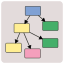
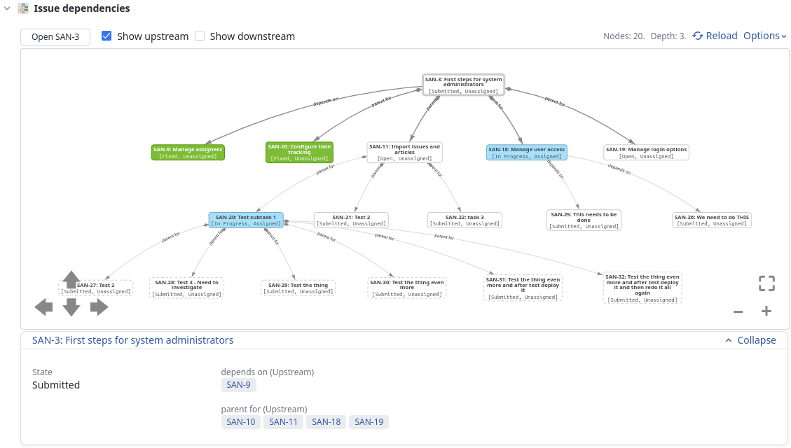
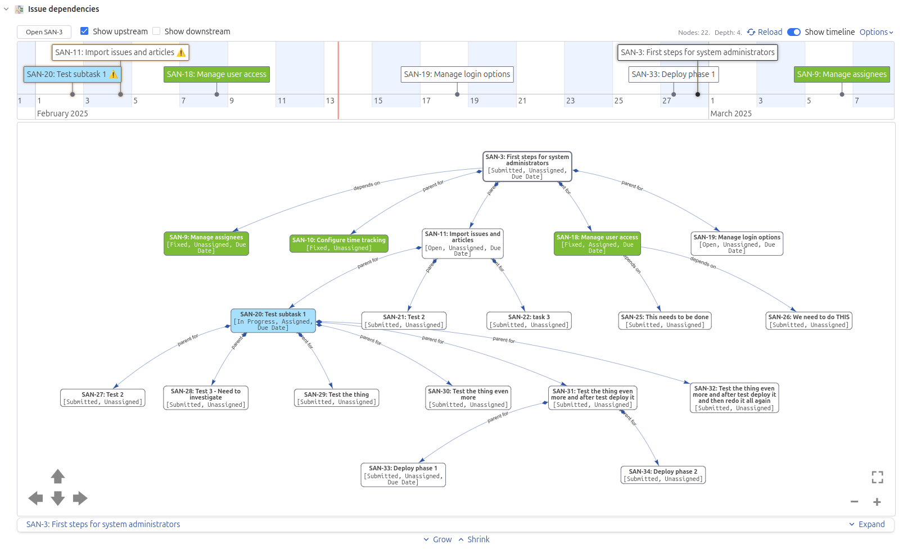
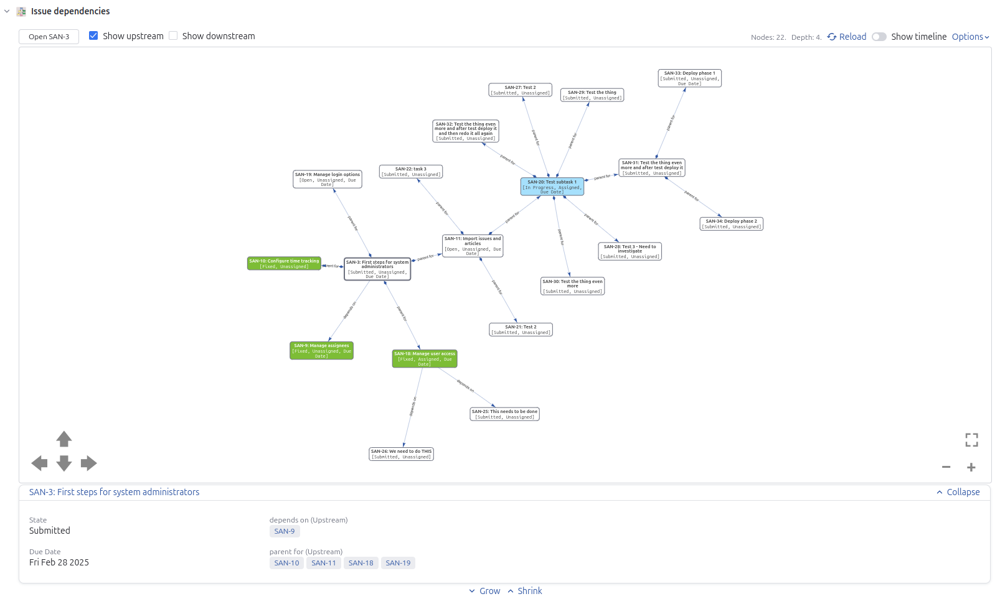
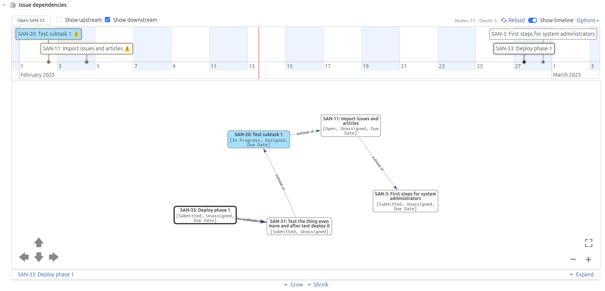

# YouTrack Issue Dependency Visualization App



YouTrack app to visualize issue dependencies. The issue dependencies are visualized using a graph or
tree including configured upstream and/or downstream relations. This allows for e.g. visualizing
*all* upstream issues that an issue depend on including all subtasks and issues depended on.

Optionally the issues visible in the graph that also has a *Due Date* set can be visualized on a
time-line. This helps when for example trying to understand if all upstream issues has *Due Dates*
aligned with the current issue. It also helps the other way around, i.e. when trying to understand
if any downstream issue (dependent issue) has a *Due Date* that infers an implicit deadline to the
current issue.

Any custom YouTrack Issue Link Types are also supported.

Visualization is performed using [vis.js] components [vis-network] and [vis-timeline].

[vis.js]: https://visjs.org/
[vis-network]: https://github.com/visjs/vis-network
[vis-timeline]: https://github.com/visjs/vis-timeline

## Screenshots

### Tree with issue preview open



Note that tree root element SAN-3 is selected.

### Tree with due date timeline open




Note the warning signs for the two unresolved issues that are overdue.

### Alternate rendering as a node graph



### Visualizing downstream dependencies with due date timeline



Visualizing all downstream dependencies of SAN-33. Note that SAN-33 has a due date which is not
aligned with the two downstream (dependent) issues SAN-20 and SAN-11. The SAN-3 due date is aligned
though.

## Installation and Setup

### Local install

```
npm install
npm run build
```

### Upload to specific youtrack instance

```
npm run upload -- --host <YOUTRACK_URL> --token <YOUTRACK_TOKEN>
```

### Configuration

#### Global app settings

##### Automatically load issue dependencies

When enabled, the dependency graph is automatically loaded when each issue is opened. When disabled,
the graph is loaded on request by clicking the "Load graph..." button.

##### Use hierarchical tree layout

When enabled, the dependency graph is rendered as a tree instead of as a node graph.

##### Maximum recursion depth

The maximum graph depth to recurse when loading the relations for a ticket. If not all relations can
be followed without reaching the maximum graph depth is reached, then the nodes for which not all
relations are known are visualized with a dashed border.

#### Per project app settings

##### State field name

Set to the name of the field in the project representing the issue state. The YouTrack default name
for this field is `State`.

##### Assignee field name

Set to the name of the field in the project representing the issue assignee. The YouTrack default
name for this field is `Assignee`.

##### Due Date field name

Set to the name of the field in the project representing the issue Due Date. The YouTrack default
name for this field is `Due Date`.

The Due Date field is used to visualize issues in a timeline.

##### Upstream relations

Comma-separated list of upstream relations. Each relation is given as the pair `direction:type`
where direction is one of `inward` or `outward` and `type` is the relation type.

An upstream relation is defined as a relation that the downstream issue has some dependency towards.

In a default YouTrack setup having the `Subtask` and `Depend` relations the upstream relations
configuration should be set to `outward:subtask,inward:depend`. This identifies the relations
*parent for* and *depends on*.

##### Downstream relations

Comma-separated list of downstream relations. Each relation is given as the pair `direction:type`
where direction is one of `inward` or `outward` and `type` is the relation type.

In a default YouTrack setup having the `Subtask` and `Depend` relations the downstream relations
configuration should be set to `inward:subtask,outward:depend`. This identifies the relations
*subtask of* and *is required for*.
