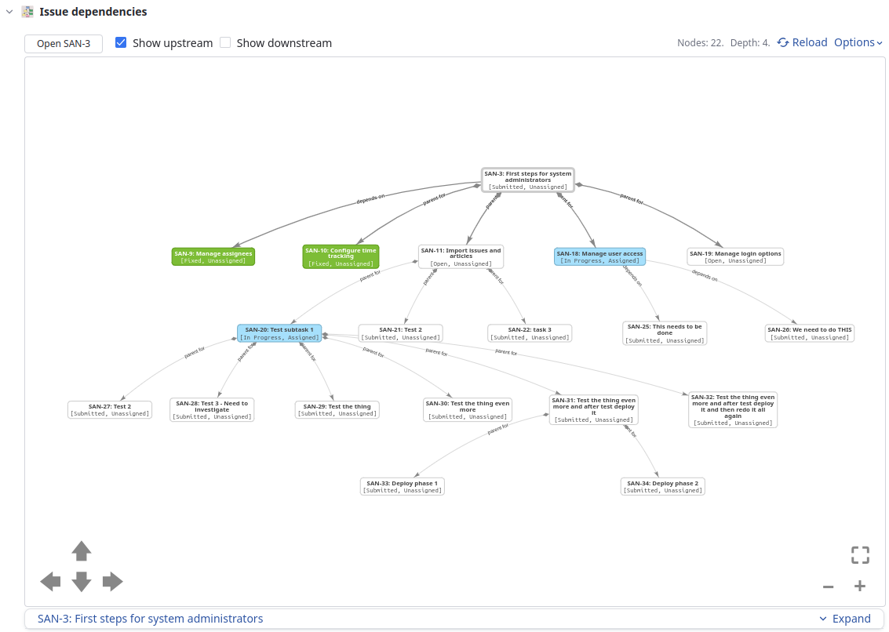

# YouTrack Issue Dependency Visualization App


This YouTrack app allows visualizing directed issue dependencies. The dependencies
are visualized as a graph or tree using [vis.js](visjs.org).

## Screenshots





## Installation and Setup

### Local install

```
npm install
npm run build
```

### Upload to specific youtrack instance

```
npm run upload -- --host <YOUTRACK_URL> --token <YOUTRACK_TOKEN>
```

### Configuration

#### Global app settings

##### Automatically load issue dependencies

When enabled, the dependency graph is automatically loaded when each issue is opened. When disabled,
the graph is loaded on request by clicking the "Load graph..." button.

##### Use hierarchical tree layout

When enabled, the dependency graph is rendered as a tree instead of as a node graph.

#### Per project app settings

##### State field name

Set to the name of the field in the project representing the issue state. The YouTrack default name
for this field is `State`.

##### Assignee field name

Set to the name of the field in the project representing the issue assignee. The YouTrack default
name for this field is `Assignee`.

##### Upstream relations

Comma-separated list of upstream relations. Each relation is given as the pair `direction:type`
where direction is one of `inward` or `outward` and `type` is the relation type.

An upstream relation is defined as a relation that the downstream issue has some dependency towards.

In a default YouTrack setup having the `Subtask` and `Depend` relations the upstream relations
configuration should be set to `outward:subtask,inward:depend`. This identifies the relations
*parent for* and *depends on*.

##### Downstream relations

Comma-separated list of downstream relations. Each relation is given as the pair `direction:type`
where direction is one of `inward` or `outward` and `type` is the relation type.

In a default YouTrack setup having the `Subtask` and `Depend` relations the downstream relations
configuration should be set to `inward:subtask,outward:depend`. This identifies the relations
*subtask of* and *is required for*.
